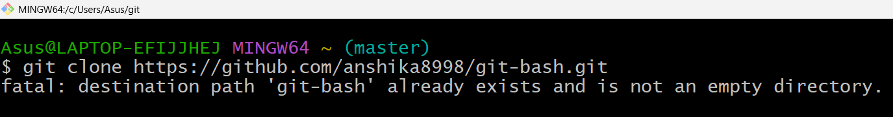
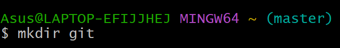
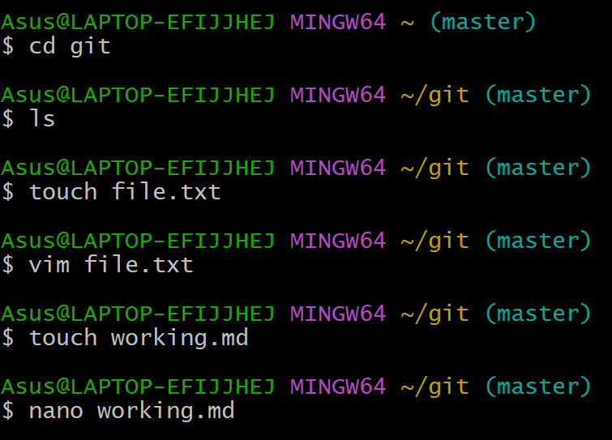

1) To attach your git repository to git bash use: git clone

2) To create directory use: mkdir name-of-directory

3) TO create an empty file use: touch name-of-file

4) To go inside any directory or file use: cd name-of-file/directory

5) To create markdown file use: touch name-of-markdownFile

6) To edit file use: vim name-of-the-file

7) To edit file use: nano name-of-the-file

8) To create branch use: git branch name-of-branch

